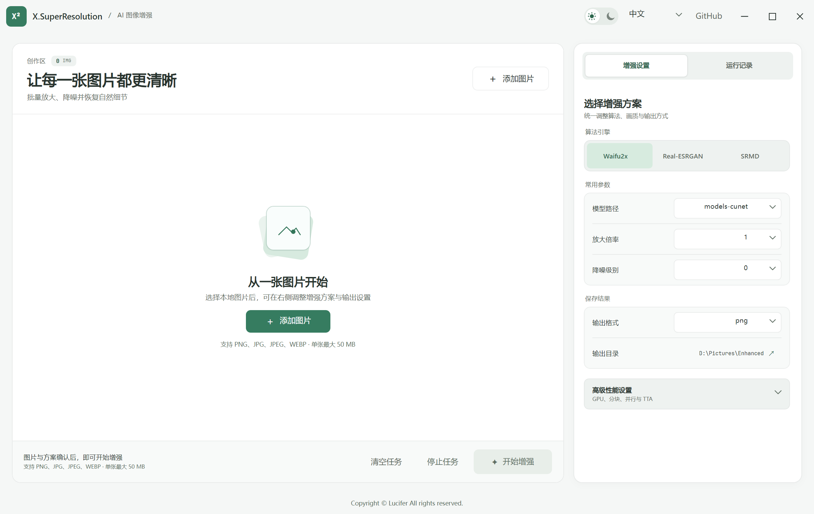
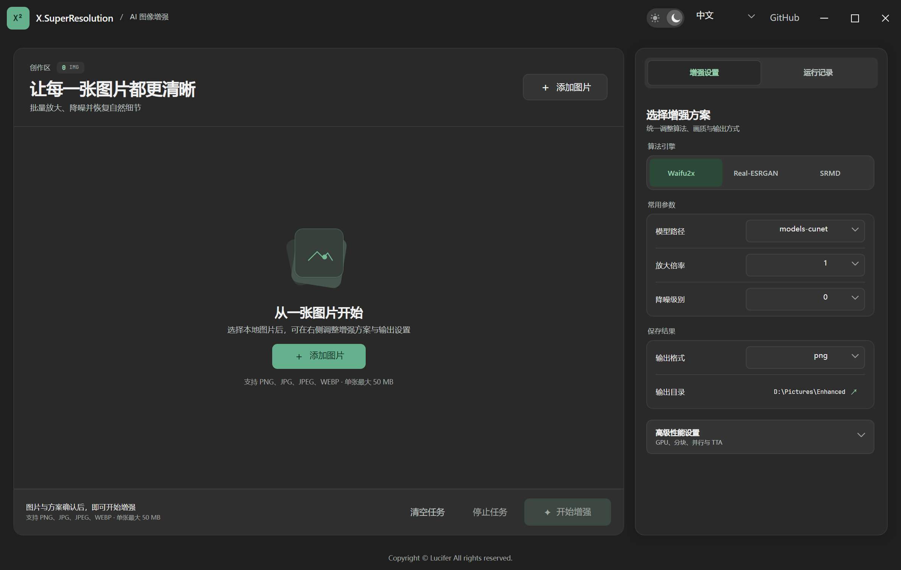

# X.SuperResolution

在本地完成图片放大、降噪与细节增强的桌面工具。基于 Avalonia 和 NCNN-Vulkan，提供 Waifu2x、Real-ESRGAN、SRMD 三种引擎，图片处理无需联网。

[下载发行版](https://github.com/X-Lucifer/X.SuperResolution/releases) · [模型目录说明](FOLDER_STRUCTURE.md) · [安装包构建说明](installer/README.md)

## 运行预览

以下截图来自 Windows 桌面实际运行的界面，展示亮暗主题及增强参数设置。

**清透白 · 图片工作区**



**石墨灰 · 暗色主题**



## 功能

- **三种增强引擎**：切换 Waifu2x、Real-ESRGAN、SRMD，并选择对应模型、倍率和降噪参数。
- **批量任务队列**：一次添加多张图片，查看单张进度、处理状态及耗时，支持停止任务和清理队列。
- **输出可配置**：导出 PNG、JPG 或 WEBP，自定义保存目录。
- **性能参数**：选择 GPU 设备、分块大小、线程配置及 TTA。
- **运行记录**：查看批次耗时、处理日志和设备信息。
- **桌面体验**：亮暗主题、简体中文与英文语系，以及页签、开关和下拉菜单的平滑过渡。

## 系统与运行环境

当前仓库面向 **Windows 10 / 11 x64** 提供发布脚本，使用 **.NET 10**。目标电脑需要支持 Vulkan 的 GPU 及相应的 x64 显卡驱动。

| 构建包 | .NET 运行时 | 模型文件 |
| --- | --- | --- |
| 完整包 `full` | 已包含，无需单独安装 .NET | 已包含 |
| 精简包 `thin` | 需要安装 .NET 10 x64 Runtime | 需要另行补齐 |

两种发布脚本都会复制原生引擎所需的 `vcomp140.dll`。请保留完整的解压目录，不要只移动主程序。

## 快速开始

1. 从 [Releases](https://github.com/X-Lucifer/X.SuperResolution/releases) 下载适合的发行包，安装或解压到有写入权限的目录。
2. 启动 `X.SuperResolution.exe`，点击 **添加图片**。支持 PNG、JPG、JPEG、WEBP，单张上限为 50 MB。
3. 在 **增强设置** 中选择引擎、模型、放大倍率和降噪参数。可用选项随引擎变化。
4. 选择输出格式与保存目录。默认保存到程序目录下的 `output` 文件夹。
5. 点击 **开始增强**，在任务队列查看进度，在 **运行记录** 查看日志与耗时。

输出文件命名为 `原文件名_out.扩展名`。相同输出路径已有文件时会覆盖，请在需要保留多个结果时选择不同的输出目录。

主题、语系与输出目录会保存在程序目录下的 `settings.json` 中。

## 模型与目录

模型文件夹应与主程序放在同一目录，保持原有名称及内部结构。完整包的主要目录如下：

```text
X.SuperResolution/
├── X.SuperResolution.exe
├── vcomp140.dll
├── models/                              # Real-ESRGAN
├── models-cunet/                         # Waifu2x CUNet
├── models-srmd/                          # SRMD
├── models-upconv_7_anime_style_art_rgb/   # Waifu2x 动漫模型
├── models-upconv_7_photo/                # Waifu2x 照片模型
├── output/                              # 默认输出目录，运行时创建
└── settings.json                        # 设置保存后创建
```

各模型的文件组成见 [FOLDER_STRUCTURE.md](FOLDER_STRUCTURE.md)。精简包需要补齐所使用引擎的模型；不要将 `.param` 与 `.bin` 文件拆开或改名。

## 从源码运行

准备 .NET 10 SDK。原生引擎还需要 Vulkan 驱动及 x64 `vcomp140.dll`；可通过 Visual Studio 的“使用 C++ 的桌面开发”工作负载取得 OpenMP 运行库。

在仓库根目录执行：

```powershell
dotnet restore X.SuperResolution.slnx
dotnet build X.SuperResolution.slnx
```

将 OpenMP 运行库复制到调试输出目录，再启动程序：

```powershell
$vcompPath = & .\scripts\Resolve-Vcomp140.ps1
Copy-Item -LiteralPath $vcompPath -Destination .\X.SuperResolution\bin\Debug\vcomp140.dll
dotnet run --project .\X.SuperResolution\X.SuperResolution.csproj --no-build
```

模型和原生引擎文件由项目配置复制到构建输出目录。

## 构建发布包

发布脚本需要 .NET 10 SDK、7-Zip（`7z` 命令）以及上述 Visual C++ OpenMP 运行库。生成安装程序还需要 NSIS（`makensis` 命令）。

```powershell
# 完整包：包含运行时与模型
.\scripts\publish-win-x64-full.ps1

# 精简包：不包含运行时与模型
.\scripts\publish-win-x64-thin.ps1

# Windows 安装程序：自动构建完整包后打包
.\scripts\build-installer.ps1
```

| 产物 | 输出路径 |
| --- | --- |
| 完整包 | `artifacts/packages/X.SuperResolution-win-x64-full.7z` |
| 精简包 | `artifacts/packages/X.SuperResolution-win-x64-thin.7z` |
| 安装程序 | `artifacts/installer/X.SuperResolution-win-x64.exe` |

完整包和精简包共用发布输出目录，应依次构建。更多安装程序选项见 [installer/README.md](installer/README.md)。

## 常见问题

| 现象 | 检查方式 |
| --- | --- |
| 缺少 `vulkan-1.dll` | 从显卡厂商官网下载并更新支持 Vulkan 的 x64 驱动。 |
| 原生引擎无法加载或缺少 `vcomp140.dll` | 确认使用 x64 程序，并保留发行包中的运行库；源码运行时按上述步骤复制 OpenMP 运行库。 |
| 找不到模型或模型加载失败 | 检查模型目录名称、位置及 `.param` / `.bin` 文件是否完整，并确认所选模型与当前引擎匹配。 |
| 图片没有进入任务队列 | 检查文件格式和单张大小限制；超出限制的提示可在运行记录中查看。 |
| 不知道结果保存在哪里 | 查看增强设置中的输出目录；默认位置为程序目录下的 `output`。 |

## 第三方项目

- [Avalonia](https://github.com/AvaloniaUI/Avalonia)：桌面界面框架。
- [ncnn](https://github.com/Tencent/ncnn)：神经网络推理框架。
- [waifu2x-ncnn-vulkan](https://github.com/nihui/waifu2x-ncnn-vulkan)
- [realesrgan-ncnn-vulkan](https://github.com/nihui/realesrgan-ncnn-vulkan)
- [realsr-ncnn-vulkan](https://github.com/nihui/realsr-ncnn-vulkan)
- [srmd-ncnn-vulkan](https://github.com/nihui/srmd-ncnn-vulkan)

## 使用声明

不得将该程序用于任何商业及违法用途。
